# Attaque-Passive-tp

[2/19/2022]  

*REALISER PAR :*
*ZINEB EL RHAZOUANI* 
*SAID EL OUARDI*  
*ADIL ERRAD*  

1.Introduction……………………………………………….1 

1.1.Objectif du TP…………………………………………...….1.1 2.Implémentation d’un sniffer passif……………………....2 3.manipulation de sniffers………………………………….3 4. remote sniffing……………………………………………4 

Introduction : 

Les sniffers (appelé aussi « analyseurs de protocoles » ou « analyseurs de réseau ») sont des outils logiciels qui peuvent capturer les trames circulant sur un réseau local et afficher leurs contenus (entêtes des protocoles, identités des utilisateurs, mot de passe non cryptés, etc). Ces outils sont utilisés par les administrateurs pour analyser leurs réseaux et localiser les problèmes dans ces derniers. Ils sont aussi utilisés par les attaquants pour espionner les données circulant dans un réseau local. 

- Objectif du TP :
- Implémenter un sniffer passif simple .
- Manipuler des logiciels de sniffing.

Implémentation d’un sniffer passif : 

L'annexe 1 présente le code source d’un sniffer passif qui permet de récupérer les trames reçues par une interface réseau (exemple ETHERNET). Ce code source est écrit en langage C et peut être compilé et exécuté sur une machine Linux. Les fonctions les plus importantes de ce code sont (voir contenu de lafonction main):

- La fonction recvfrom qui permet de récupérer les trames reçues sur 

l’interface réseau. 

- La fonction PrintPacketInHex qui permet d’afficher la trame sous format 

hexadécimal 

- La fonction ParseEthernetHeader qui permet d’afficher quelques champs de 

l’entête ETHRNET 

- La fonction ParseIpHeader qui permet d’afficher quelques champs de 

l’entête IP 

- La fonction ParseTcpHeader qui permet d’afficher quelques champs de 

l’entête TCP 

- La fonction ParseData qui permet d’afficher les données sous format 

hexadécimal 

- La compilation et l’execution du fichier C. 
- Execution des 10 premières images reçues

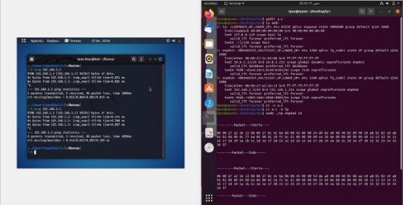

- l’affichage du contenu de l’entête ETHERNET et la recompilation , Execution des 10 premières images reçues

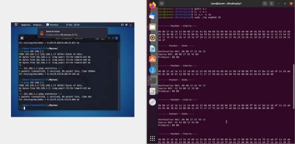

- l’Affichagedu  contenu des entêtes des protocoles des niveaux supérieurs, la recompilation , Execution des 10 premières images reçues 

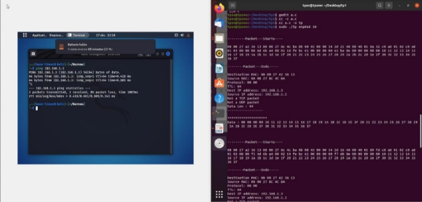

- La fonction qui permet d’afficher l’entête UDP et l’intégrer dans le code source du sniffer (localiser udp.h dans /usr/include/netinet).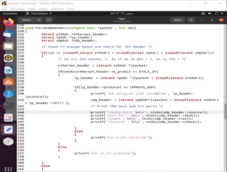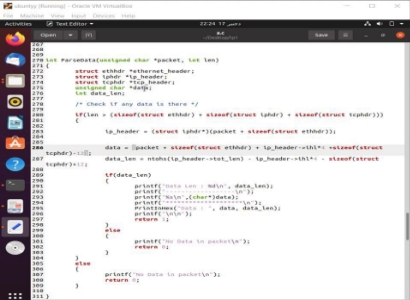

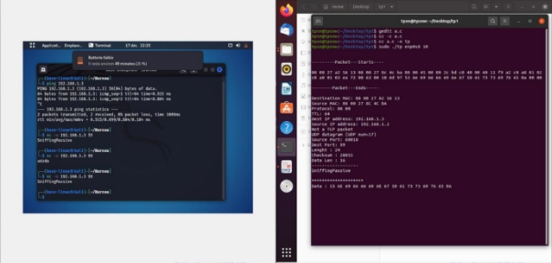

manipulation de sniffers: 

- Lanchement du Wireshark 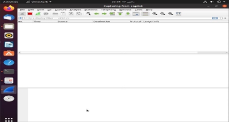
- Les applications d’échange de trafic entre d'autres machines et la votre. Observez-les paquets capturés 

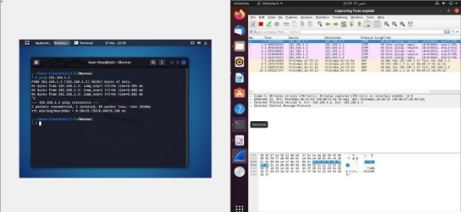

- Est-ce que vous pouvez capturer les trafics échangés entre les machines du reste du réseau?

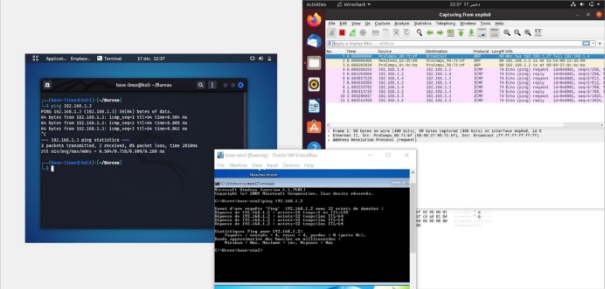

- Configuration du  filtre de wireshark  
- n'afficher que les trames concernant un protocole particulier : bootp, tcp, icmp,etc 

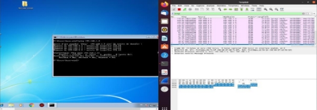

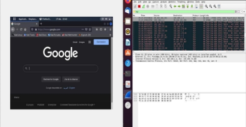

- n'afficher que les trames dont l'adresse MAC destination est celle de votre machine : 

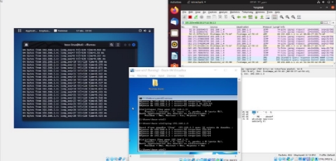

- n'afficher que les trames échangé entre deux machines d'adresse @IP1 et @IP2 : 

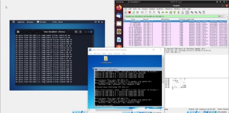

- n'afficher que les trames dont la taille est supérieure à une taille donnée 

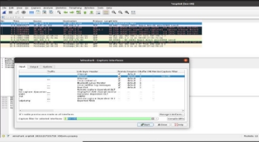
